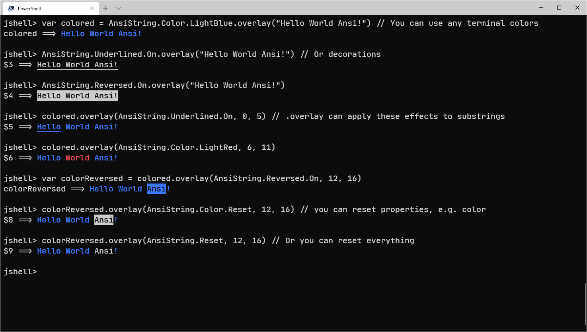
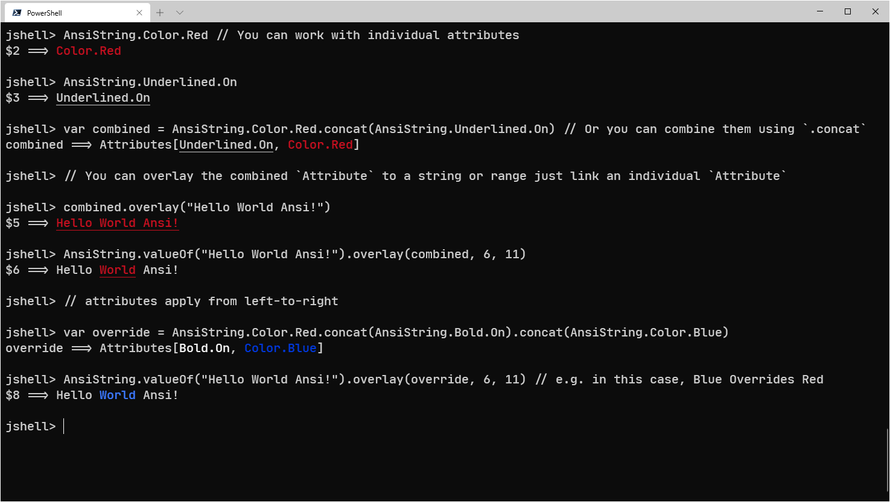

## Kala Ansi

Kala Ansi is a lightweight java library make it very easy to use ANSI decorative strings.

Kala Ansi provides `AnsiString` that you can use to easily decorate strings 
with ANSI escape sequences without worrying about color leaks. 

`AnsiString` provides low-overhead operations such as `concat` and `substring`,
use it is as easy as use `java.lang.String`.

## Adding Kala Ansi to your build

// TODO

## Features

Kala Ansi is ported from [Fansi](https://github.com/lihaoyi/fansi), 
so it is very similar to fansi, but they are not exactly the same,
Kala Ansi has its own characteristics: 

* Kala Ansi is implemented in pure Java,uIt is very lightweight (just 33 kb) and has no dependencies
  
* Compatible with Java 5+

* Provide `module-info.class`, can be easily packaged by the `jlink` tool

* Lower memory footprint than fansi (TODO: need benchmarks):
  * `AnsiString` store `String` instead of `char[]`, 
    can use the optimization of [JEP 254](https://openjdk.java.net/jeps/254) effectively
  * Try to avoid storing 0 at the front and back of the states array
  * More optimization of the internal structure, reducing the memory footprint 
    by the internal implementation of the library
    
    
## Using Kala Ansi

Kala Ansi has only one public top-level class: `asia.kala.ansi.AnsiString`,
it is the core data structure of this library that you will 
use to pass-around colored Ansi strings and manipulate them:
concatenating, splitting, applying or removing colors, etc.

* `AnsiString AnsiString.valueOf(CharSequence raw)` convert a `CharSequence` to AnsiString.
* If you need to configure the process of parsing strings, 
  use the `AnsiString AnsiString.parse(CharSequence raw, ErrorMode errorMode, boolean trimStates)` 
* If there is no ANSI escape sequence in the string, 
you can use the `AnsiString AnsiString.ofPlain(CharSequence plain)` to wrap the `CharSequence`

* `AnsiString.Attribute` represents a group of zero or more modifications,
  you can make to an `AnsiString`'s formatting. Examples are:
  * `AnsiString.Bold.{On, Off}`
  * `AnsiString.Reversed.{On, Off}`
  * `AnsiString.Underlined.{On, Off}`
  * `AnsiString.Color.*`
  * `AnsiString.Back.*`
  * `AnsiString.Reset`
 

* `Attribute Attribute.of(Attribute... attributes)` can combine attributes,
  you can also use the `.concat` method to combine multiple attributes
  

